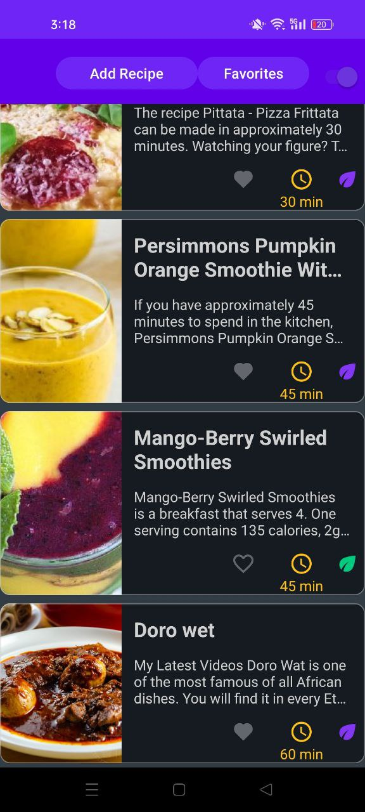
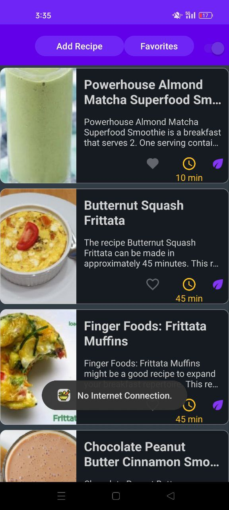

# LibRecipe App

# Navigation Components for streamlined and efficient navigation. 
  - MVVM Architecture to ensure a maintainable, testable, and scalable code structure.
  - Dagger Hilt for simplified and robust dependency injection.
  - Retrofit for seamless integration with the API to fetch recipe data.
  - Coroutines & Flow for asynchronous programming and handling streams of data efficiently.
  - Paging3 for loading large datasets in a memory-efficient way.
  - Room Database for offline storage of recipe data, enabling users to access content even without an internet connection.
  - Kotlin as the primary programming language, the official language for Android development.
  - LiveData & ViewModel for managing and persisting UI-related data across configuration changes.
  - ViewBinding for safe and efficient interaction with views.
  - Material Components for a clean, modern UI that adheres to Material Design guidelines.
  - No I/O operations on the main thread, , I/O operations are handled properly by moving them to a background thread using
    Dispatchers.IO and withContext by untilizing Coroutines for all database and network operations to ensure smooth performance and avoid UI blocking. This
    prevents them from being executed on the main thread, which is good practice to avoid
    freezing or ANR (Application Not Responding) issues.
# Efficient Layout Design:

  - Minimized Nesting: Avoid deeply nested layouts for optimal performance. Uses ConstraintLayout to position views  
    efficiently, reducing the need for nested LinearLayout or RelativeLayout.
  - Replaced Legacy Layouts: Transition from RelativeLayout to ConstraintLayout to take advantage of modern and flexible layout
     capabilities.
  - Maintainable and Scalable Code:Avoided Single-Child ConstraintLayout: Ensure ConstraintLayout is utilized effectively for
    managing multiple views. Avoided using it when there's only one child view.
  - Localization and Accessibility: No Hardcoded Text: Used strings.xml for all text to enable localization and ensure
    maintainability across languages and screen readers.

# The app feature:

  - A simple, clean Material3 UI with support for both light and dark themes 🌗 in every pages, Bottom Navigation for intuitive access to app sections such as 
    Add Recipe and see added favorite recipes.
  - Recipe list parsed via Retrofit, stored in a Room database for offline access.
  - Favorites functionality allowing users to add/remove recipes and manage favorites, with options for single or multiple
    deletions.
  - Users can add recipe manually , and see favorite recipes 
  - Detail Recipe Navigation
    
    

        
    

    
  - Favorites functionality allowing users to add/remove recipes and manage favorites, with options for single or multiple
    deletions.
    
    

        
        
    

  
  - Users can add recipe manually , and add / remove the recipe as  favorite.
    
    

        
        
    

  
  -  Supports both light and dark themes in every page with toggling the swtich in homepage 🌗
    

        
        
    

  - Recipe list parsed via Retrofit, stored in a Room database for offline access.
    

        
        
    

